  

 

### Recently active

<!--RECENT-REPOS:START-->
<table>
  <tr>
    <td><a href="https://github.com/ahmed-farhanur-rashid/ahmed-farhanur-rashid"><b>ahmed-farhanur-rashid</b></a> Verily, 'twas I, mine own self, and me.</td>
    <td align="right">—</td>
  </tr>
  <tr>
    <td><a href="https://github.com/ahmed-farhanur-rashid/gradeeye"><b>gradeeye</b></a> Ordinal deep learning for diabetic retinopathy severity grading: ConvNeXt-Tiny + CBAM attention + CORN ordinal regression, cross-dataset pretrained on EyePACS and fine-tuned on APTOS 2019.</td>
    <td align="right">Python</td>
  </tr>
  <tr>
    <td><a href="https://github.com/ahmed-farhanur-rashid/finchtune"><b>finchtune</b></a> VIsion Model Fine Tuning Platform.</td>
    <td align="right">Python</td>
  </tr>
  <tr>
    <td><a href="https://github.com/ahmed-farhanur-rashid/videous-downloadius"><b>videous-downloadius</b></a> yt-dlp wrapper.</td>
    <td align="right">Python</td>
  </tr>
</table>
<!--RECENT-REPOS:END-->

 

### Stats

  
  

 

### Stack

<!--STACK:START-->

  
  
  
  
  
  
  
  
  
  

<!--STACK:END-->

 

  WIP is a permanent state, not a phase

