  

 

### Recently active

<!--RECENT-REPOS:START-->
<table>
  <tr>
    <td><a href="https://github.com/ahmed-farhanur-rashid/slate-whiteboard"><b>slate-whiteboard</b></a> Whiteboard I built for my daily scribbles. Personal tool. Feel free to fork and use it though.</td>
    <td align="right">JavaScript</td>
  </tr>
  <tr>
    <td><a href="https://github.com/ahmed-farhanur-rashid/qmew"><b>qmew</b></a> (WiP) QMEW (Quick Multi-Endpoint Workspace): Open-source, cross-platform P2P remote desktop with LAN-first connectivity, global peer-to-peer access, and multi-device control.</td>
    <td align="right">—</td>
  </tr>
  <tr>
    <td><a href="https://github.com/ahmed-farhanur-rashid/gradeeye"><b>gradeeye</b></a> Ordinal deep learning for diabetic retinopathy severity grading: ConvNeXt-Tiny + CBAM attention + CORN ordinal regression, trained using LODO strategy on Eyepacs, Aptos, Messidor-2 & DDR.</td>
    <td align="right">Python</td>
  </tr>
  <tr>
    <td><a href="https://github.com/ahmed-farhanur-rashid/crumb-ai"><b>crumb-ai</b></a> Compact Reasoning Unit for Mamba-attention Builds (CRUMB)</td>
    <td align="right">Python</td>
  </tr>
</table>
<!--RECENT-REPOS:END-->

 

### Stats

<!--STATS-IMG:START-->

  
  

<!--STATS-IMG:END-->

 

### Stack

<!--STACK:START-->

  

<!--STACK:END-->

 

  WIP is a permanent state, not a phase

